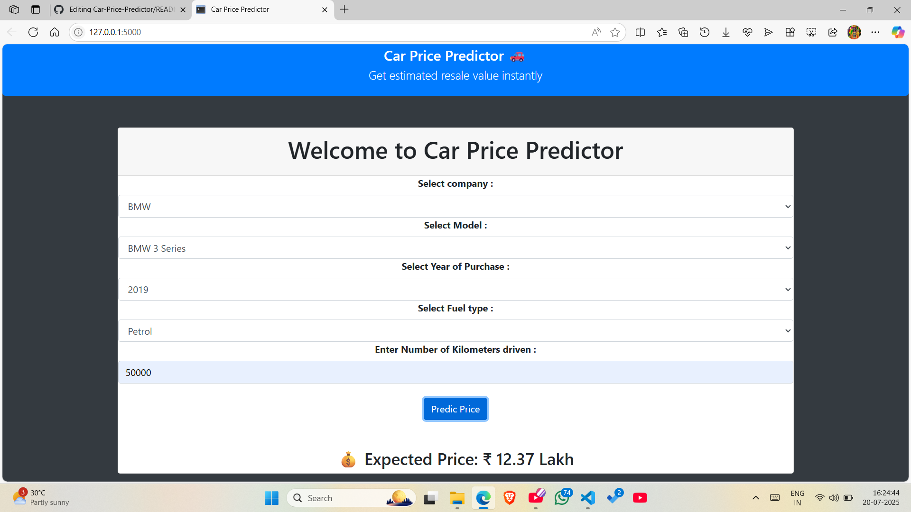

# 🚗 Car Price Predictor

> Predict the resale price of a used car using machine learning — now live at  
👉 [https://car-price-predictor-nirav-rupapara.onrender.com/](https://car-price-predictor-nirav-rupapara.onrender.com/)

---

## 📸 Live Demo

---

## 💡 Project Overview

Car Price Predictor is a machine learning-powered web application that estimates the resale price of a used car based on user-provided inputs like:

- **Car Brand & Model**
- **Fuel Type**
- **Year of Purchase**
- **Kilometers Driven**
- **Owner Type**

Built with Flask for the backend and scikit-learn for modeling, the app is designed to be lightweight, fast, and user-friendly.

---

## 🧠 Machine Learning Details

- **Model Used**: Linear Regression  
- **Preprocessing**:
  - One-hot encoding of categorical features
  - Feature scaling (StandardScaler)
- **Dataset**: Cleaned dataset with the following features:
  - `Car Name`, `Company`, `Year`, `Fuel Type`, `KMs Driven`, `Owner`
- **Target**: Selling Price (in Lakhs ₹)

---

## 🛠️ Tech Stack

| Layer      | Tools Used                           |
|------------|--------------------------------------|
| Frontend   | HTML, CSS (Bootstrap), JavaScript    |
| Backend    | Python, Flask                        |
| ML Model   | pandas, scikit-learn, pickle         |
| Deployment | Render.com                           |

---

## 🚀 How It Works

1. User selects or inputs car details in the form
2. Data is preprocessed and fed to a trained ML model
3. Predicted car price is displayed instantly on the screen

---

## 🔗 Deployment

This app is deployed and live on [Render](https://render.com), and will auto-update with every GitHub push.

